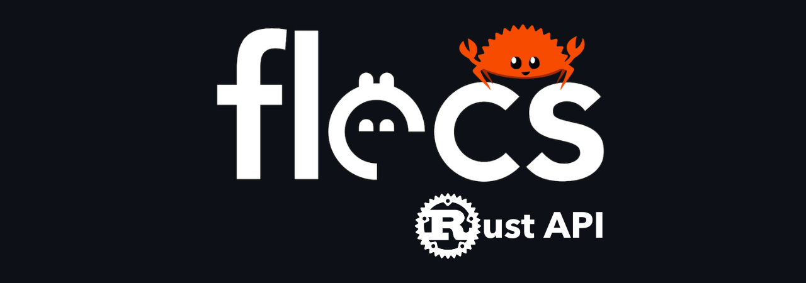

# 

[](https://github.com/SanderMertens/flecs/releases)
[](https://github.com/Indra-db/Flecs-Rust/blob/master/LICENSE)
[](https://github.com/indra-db/Flecs-Rust/actions/workflows/ci.yml)
[](https://www.flecs.dev/flecs/md_docs_2Docs.html)
[](https://discord.gg/jkEZ2jQD6F)

## What is the Flecs Rust API?
The Rust API is a wrapper around the [Flecs](https://github.com/SanderMertens/flecs) C API. The API is designed to offer Rust developers an intuitive and streamlined interface to harness the full potential of Flecs.

It's based on V4 flecs release, blogpost can be found [here](https://ajmmertens.medium.com/flecs-v4-0-is-out-58e99e331888).

## What is Flecs ECS?

[Flecs](https://github.com/SanderMertens/flecs) is a fast and lightweight Entity Component System that lets you build games and simulations with millions of entities ([join the Discord!](https://discord.gg/BEzP5Rgrrp)). Here are some of the framework's highlights:

- Fast and portable. Due to Flecs C core, it has major bindings in several languages, including C++, C#, and now Rust!
- First open source ECS with full support for [Entity Relationships](https://www.flecs.dev/flecs/md_docs_2Relationships.html)!
- Fast native support for [hierarchies](https://www.flecs.dev/flecs/md_docs_2Relationships.html#the-childof-relationship) and [prefabs](https://www.flecs.dev/flecs/md_docs_2Relationships.html#the-isa-relationship)
- Runs [in the browser](https://flecs.dev/city) (Rust instructions TBD / WIP)
- Cache-friendly [archetype/SoA storage](https://ajmmertens.medium.com/building-an-ecs-2-archetypes-and-vectorization-fe21690805f9) that can process millions of entities every frame
- Supports entities with hundreds of components and applications with tens of thousands of archetypes
- Automatic component registration that works out of the box across shared libraries/DLLs
- Write free functions with [queries](https://github.com/Indra-db/Flecs-Rust/blob/main/flecs_ecs/examples/flecs/queries/query_basics.rs) or run code automatically in [systems](https://github.com/Indra-db/Flecs-Rust/blob/main/flecs_ecs/examples/flecs/systems/system_pipeline.rs)
- Run games on multiple CPU cores with a fast lockless scheduler
- Flecs is heavily tested, running more than 8000 tests in its core library alone and used in AAA engines. The Rust API itself has 500+ tests and counting.
- Integrated (WIP Rust) [reflection framework](https://www.flecs.dev/flecs/group__c__addons__meta.html) with [JSON serializer](https://github.com/SanderMertens/flecs/tree/master/examples/cpp/reflection/basics_json) and support for [runtime components](https://github.com/SanderMertens/flecs/tree/master/examples/cpp/reflection/runtime_component)
- Powerful [query language](https://github.com/Indra-db/Flecs-Rust/tree/main/flecs_ecs/examples/flecs/queries) with support for [joins](https://github.com/Indra-db/Flecs-Rust/blob/main/flecs_ecs/examples/flecs/queries/query_setting_variables.rs) and [inheritance](https://github.com/Indra-db/Flecs-Rust/blob/main/flecs_ecs/examples/flecs/queries/query_component_inheritance.rs)
- [Statistics addon](https://www.flecs.dev/flecs/group__c__addons__stats.html) for profiling ECS performance
- A web-based UI for monitoring & controlling your apps ([demo](https://flecs.dev/explorer), [code](https://github.com/flecs-hub/explorer)):

## How to get started?

Add the following to your `Cargo.toml`:

```toml
[dependencies]
flecs_ecs = "0.1.1" 

```

and start hacking away!

Make sure to check out the Rust docs (improvements coming soon), [Flecs docs](https://www.flecs.dev/flecs/md_docs_2Docs.html), and the 70+ examples in the [examples](https://github.com/Indra-db/Flecs-Rust/blob/main/flecs_ecs/examples/flecs/) directory.

For an example integration of Flecs with the following crates:

- `WGPU` for rendering
- `winit` for windowing
- `vello` for rasterization
- `parley` for text

check out the demo [here](https://github.com/james-j-obrien/flecs-wgpu-demo)


## Status: Alpha release

The project is in the alpha release stage where the **core functionality** and some **addons** of Flecs have been **ported** and are available to use today. While there has been a lot of thought put into the current API, it's still in an experimental phase. The project aims to hit stable when all the soundness/safety issues are resolved and the API has been finalized with all of Flecs functionality. We encourage you to explore, test, and provide feedback, but please be aware of potential bugs and breaking changes as we continue to refine the API and add new features.

This library was made publicly available on the release date of Flecs V4 release.

#### Safety

One important safety factor that has yet to be addressed is having multiple aliases to the same component. This is a known issue and is being worked on. It will be addressed through a table column lock mechanism.

#### Performance

From initial benchmarks and tests, the Rust API is on par with C-level performance, except for where overhead was introduced to make the API safe to use in Rust land (e.g. `get` performance). However, performance improvements are planned to be made in the future.

### The progress

For detailed feature progress, please visit the [issues](https://github.com/Indra-db/Flecs-Rust/issues) page.

- Core library 
- Addons  (Meta + Json + Script are a WIP, expected to be released by end of August, experimental phase sooner)
- Documentation  Most functions are documented and contain a C++ alias. Flecs documentation site contains Rust code. The remaining % is for adding mostly doc test examples and refining the Rust docs page.
- Test suite  (entity, query, observers systems test cases are done)
- Examples  For the current feature set, all examples are done.

## The Aim

The plan is to match feature parity of the C++ API, starting with the core library (done!) while also being fully documented and tested and addressing any safety issues that may arise. The project aims to provide a safe, idiomatic, and efficient Rust API for Flecs, while also being a good citizen in the Rust ecosystem.

## Contributions

If you're excited about this project and would like to contribute, or if you've found any bugs, please feel free to raise an issue or submit a pull request. We'd love to have your involvement!

## License

MIT license, matching Flecs.

## Example code
```rust

use flecs_ecs::prelude::*;

#[derive(Debug, Component)]
pub struct Position {
    pub x: f32,
    pub y: f32,
}

#[derive(Debug, Component)]
pub struct Velocity {
    pub x: f32,
    pub y: f32,
}

#[derive(Component)]
pub struct Eats;

#[derive(Component)]
pub struct Apples;

fn main() {
    // Create a new world
    let world = World::new();

    // Register system
    world
        .system::<(&mut Position, &Velocity)>()
        .each(|(pos, vel)| {
            pos.x += vel.x;
            pos.y += vel.y;
        });

    // Create an entity with name Bob, add Position and food preference
    let bob = world
        .entity_named("Bob")
        .set(Position { x: 0.0, y: 0.0 })
        .set(Velocity { x: 1.0, y: 2.0 })
        .add::<(Eats, Apples)>();

    // Show us what you got
    println!("{}'s got [{:?}]", bob.name(), bob.archetype());

    // Run systems twice. Usually this function is called once per frame
    world.progress();
    world.progress();

    bob.get::<&Position>(|pos| {
        // See if Bob has moved (he has)
        println!("{}'s position: {:?}", bob.name(), pos);
    });

    // Output:
    //  Bob's got [Position, Velocity, (Identifier,Name), (Eats,Apples)]
    //  Bob's position: Position { x: 2.0, y: 4.0 }
}
```

## FAQ

### What's next?

* Meta, Json, Script addons. This will allow for reflection, serialization, and scripting capabilities for creating entities and components. See the [Flecs documentation](https://github.com/SanderMertens/flecs/blob/v4/docs/FlecsScript.md) for more information.
* Wasm unknown unknown. The project is currently in the process of supporting wasm32-unknown-unknown target. This is expected to land in some shape or form by the end of August.
* API refinements, resolving safety issues & documentation.
* C# scripting support. Integration with [Flecs.Net](https://github.com/BeanCheeseBurrito/Flecs.NET) to work seamlessly with Flecs Rust API.
* More demos and examples.

### How does it compare to other Rust ECS libraries?

Flecs isn't written natively in Rust, it's written in C, but it's a mature and feature-rich ECS library that has been used in AAA games and other commercial software. It's fast, lightweight, and has a lot of features that other ECS libraries don't have.

Some of the features that make Flecs stand out are:

* Everything's an entity. Systems, queries and components are all entities.
* Focus on builder APIs and DSL macro over the type system:
    * [Builder API]
    ```rust
    world.system::<&A>()
    .with::<B>()
    .each(|| { });
    ```
    * [DSL API]
    ```rust
    system!(world, &A, B)
    .each(|| { });
    ```
* Singletons (Resources) are modelled as a component added to it's own entity.
    ```rust
    world.set(GameTime { delta_time: 0.0 });
    ```
    * [Builder API]
    ```rust
    world.system::<&GameTime>()
    .term_at(0)
    .singleton()
    .each(|| { });
    ```
    * [DSL API]
    ```rust
    system!(world, &R($))
    .each(|| { });
    ```
* Systems/observers are based on queries, and will only run if that query matches.
* Systems are single-threaded by default and run in order of declaration (See docs for more info on how parallelism and how pipelines work in flecs)
* Support for building your own custom Pipeline.
* Relationships are first-class citizens in Flecs, allowing for easy creation of hierarchies.
    * union relationships, exclusive relationships, oneof constraints, relationship traversal, reflexive relationships
* component inheritance
* transitivity
* query variables
* toggleable components
* entity disabling
* builtin hierchies with automatic cleanup
* prefabs, prefab inheritance, prefab slots, prefab hierarchies
* flecs script & flecs script templates
* (hierarchical) entity names
* archetype-level change detection
* query sorting
* query grouping
* support for unregistration: component, modules (plugins), systems, observers
* event propagation, event forwarding
* runtime components
* runtime reflection with a language agnostic reflection framework
* a language agnostic core
* etc 

## Projects using Flecs Rust API

This list contains projects that are not under NDA. 

If you want to showcase your project, feel free to open a PR to add it to the list.

* [Hyperion]: It switched from using Envio ECS to Flecs, with great performance improvements. It's quest is to break the world record minecraft event of 10000 players.
    

## Acknowledgements

A big shoutout to [Sander Mertens](https://github.com/SanderMertens) for creating such a wonderful library and the pre-alpha testers who contributed to Flecs Rust API, especially [James](https://github.com/james-j-obrien), [Bruce](https://github.com/waywardmonkeys), and [Andrew](https://github.com/andrewgazelka).


